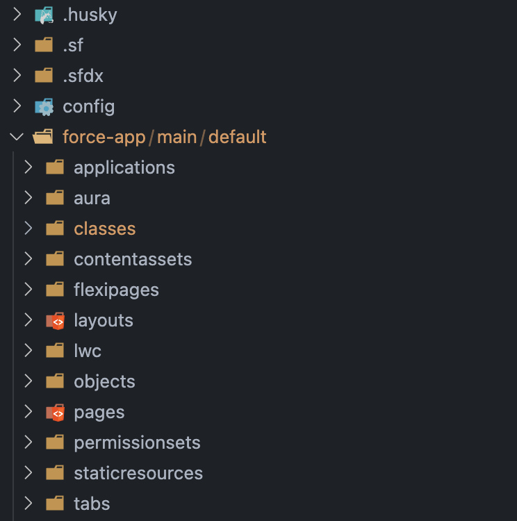
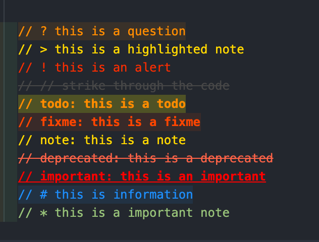

# Dev Pack for Salesforce


Dev Pack for Salesforce is a collection of useful VS Code extensions for Salesforce development. The pack includes extensions for Apex, Lightning Web Components (LWC), SOQL queries, and general development features.

## Included Extensions

- [Salesforce Extension Pack](https://marketplace.visualstudio.com/items?itemName=salesforce.salesforcedx-vscode)
  - [Salesforce Apex](https://marketplace.visualstudio.com/items?itemName=salesforce.salesforcedx-vscode-apex)
  - [Salesforce Lightning Web Components](https://marketplace.visualstudio.com/items?itemName=salesforce.salesforcedx-vscode-lwc)
  - [Salesforce SOQL](https://marketplace.visualstudio.com/items?itemName=salesforce.salesforcedx-vscode-soql)
  - [Salesforce Core](https://marketplace.visualstudio.com/items?itemName=salesforce.salesforcedx-vscode-core)
- [Agentforce for Developers](https://marketplace.visualstudio.com/items?itemName=salesforce.salesforcedx-einstein-gpt)
- [Markdownlint](https://marketplace.visualstudio.com/items?itemName=DavidAnson.vscode-markdownlint)
- [Prettier](https://marketplace.visualstudio.com/items?itemName=esbenp.prettier-vscode)
- [ESLint](https://marketplace.visualstudio.com/items?itemName=dbaeumer.vscode-eslint)
- [VSCode Icons](https://marketplace.visualstudio.com/items?itemName=vscode-icons-team.vscode-icons)
- [One Dark Pro Theme](https://marketplace.visualstudio.com/items?itemName=zhuangtongfa.Material-theme)
- [Better Comments](https://marketplace.visualstudio.com/items?itemName=aaron-bond.better-comments)
- [Indent Rainbow](https://marketplace.visualstudio.com/items?itemName=oderwat.indent-rainbow)
- [Apex Log Analyzer](https://marketplace.visualstudio.com/items?itemName=financialforce.lana)
- [Code Spell Checker](https://marketplace.visualstudio.com/items?itemName=streetsidesoftware.code-spell-checker)
- [Lightning Flow Scanner](https://marketplace.visualstudio.com/items?itemName=ForceConfigControl.lightningflowscanner)
- [Salesforce Code Analyzer](https://marketplace.visualstudio.com/items?itemName=salesforce.sfdx-code-analyzer-vscode)
- [Log File Highlighter](https://marketplace.visualstudio.com/items?itemName=emilast.LogFileHighlighter)

## Installation

1. Launch Visual Studio Code
2. Go to View → Extensions
3. Search for `Dev Pack for Salesforce`
4. Click on Install
5. Reload Visual Studio Code to complete the installation.

## Automatic Theme and Icon Setup

On the first installation, Dev Pack for Salesforce automatically sets the following themes and icons:

- Icon theme: `vscode-icons`
- Color theme: `One Dark Pro Darker`



This setup is only done the first time the extension is installed. Feel free to change after the initial setup.

## Automatic Package Detection and Installation

Dev Pack for Salesforce automatically detects and prompts you to install the following required npm packages if they are not already installed:

- `@salesforce/cli`
- `prettier`
- `@prettier/plugin-xml`
- `prettier-plugin-apex`

### Manual Trigger

You can manually trigger the package installation process by running the following command:

```json
{
  "command": "dev-pack-salesforce.forceCheckPackages",
  "title": "Dev Pack for Salesforce: Install required node modules"
}
```

To run this command:

- Open the Command Palette (View → Command Palette or Cmd+Shift+P).
- Type Dev Pack for Salesforce: Install required node modules and select it.

## Update Prettier Settings

This command updates the Prettier settings for Apex and JavaScript files in your workspace which enables formatting using prettier and features like format on save.
You can manually update the Prettier settings by running the following command:

```json
{
  "command": "dev-pack-salesforce.updateSettings",
  "title": "Dev Pack for Salesforce: Update prettier formatting settings"
}
```

To run this command:

- Open the Command Palette (View → Command Palette or Cmd+Shift+P).
- Type Dev Pack for Salesforce: Update prettier formatting settings and select it.

## Update Better Comments Settings

This introduces some comment highlighting tags which helps improve readability.
Try some of these:

```apex
// ? this is a question
// > this is a highlighted note
// ! this is an alert
// // strike through the code
// todo: this is a todo
// fixme: this is a fixme
// note: this is a note
// deprecated: this is a deprecated
// important: this is an important
// # this is information
// * this is a important note

```




You can manually update the Better Comments settings by running the following command:

```json
{
  "command": "dev-pack-salesforce.updateBetterCommentsSettings",
  "title": "Dev Pack for Salesforce: Update better comments settings"
}
```

To run this command:

- Open the Command Palette (View → Command Palette or Cmd+Shift+P).
- Type Dev Pack for Salesforce: Update better comments settings and select it.


## Usage

After installing Dev Pack for Salesforce, you will have access to all the included extensions. Simply open a Salesforce project and start developing!

## License

This extension pack is licensed under the MIT License. See the LICENSE file for more information.

## Contributing

Contributions are welcome! If you'd like to contribute to this project, please open an issue or a pull request on GitHub.
